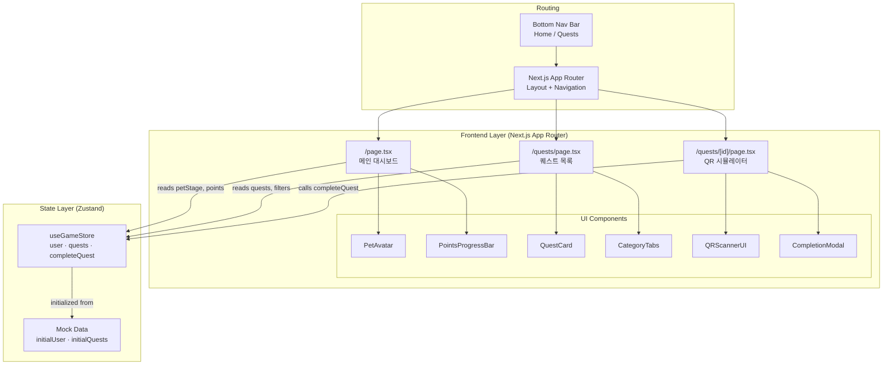
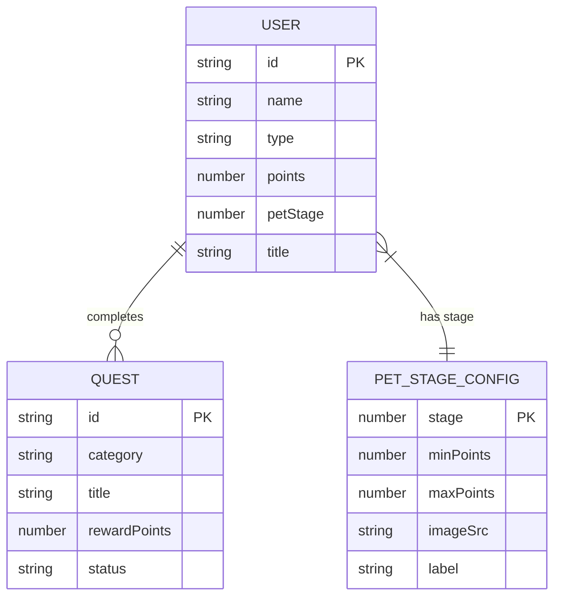
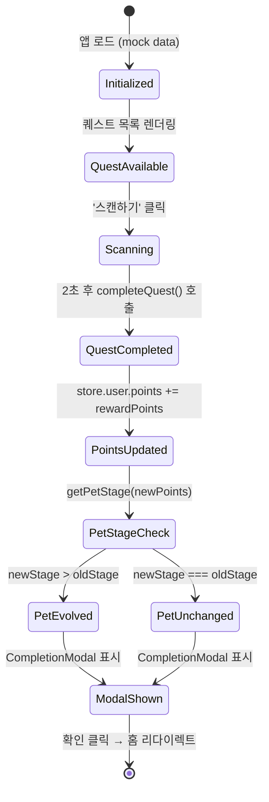

# Implementation Plan: Mega-Quest MVP (Full)

**Epic:** Mega-Quest MVP — 모바일 기반 온보딩 통합 에이전트  
**Feature:** 전체 MVP — 메인 대시보드 + 퀘스트 로드맵 + QR 미션 시뮬레이터  
**Stack:** Next.js (App Router) · Tailwind CSS · Zustand · TypeScript · Mock Data

---

## Goal

Mega-Quest MVP는 신입사원이 모바일 웹앱을 통해 온보딩 퀘스트를 게임처럼 수행할 수 있도록 하는 프론트엔드 전용 애플리케이션이다. 실제 백엔드 없이 mock 데이터와 클라이언트 전역 상태만으로 데모를 완성하는 것이 핵심 목표다. 3개의 주요 화면(대시보드, 퀘스트 목록, QR 시뮬레이터)을 구현하고, 포인트 획득과 펫 진화가 실시간으로 반영되는 완결된 데모 플로우를 제공한다. 해커톤 심사자가 직접 플로우를 체험할 수 있는 수준의 완성도를 목표로 한다.

---

## Requirements

### 기능 요구사항

**전역 상태 (Zustand Store)**
- `user`: `{ id, name, type, points, petStage, title }` 초기값 mock 설정
- `quests`: Quest 배열, mock 데이터로 초기화
- `completeQuest(questId)`: 해당 퀘스트 상태 → `completed`, 포인트 += `reward_points`, `petStage` 재계산
- `petStage`는 포인트 기준 자동 계산: 0–9P = 1, 10–14P = 2, 15P+ = 3
- 퀘스트 상태 변경은 불변 업데이트(immer 또는 spread)로 처리

**메인 대시보드 (`/`)**
- 트리니티 펫 이미지를 `petStage`에 따라 3종 중 하나 표시
- 현재 포인트 수치 표시
- 다음 단계까지 남은 포인트 기반 progress bar (0–100%)
- '오늘의 일일 퀘스트' 바로가기 버튼 → `/quests?category=daily` 이동
- 퀘스트 완료 시 펫 진화 피드백(단계 전환 시 클래스 변경 또는 간단한 CSS 트랜지션)

**퀘스트 로드맵 (`/quests`)**
- URL 쿼리 파라미터 `?category=` 로 기본 탭 제어 가능
- 3개 카테고리 탭: `hr-beginner` / `role-specific` / `daily-monthly`
- 각 퀘스트 카드: 제목, 보상 포인트, 상태 배지(`locked` / `available` / `completed`)
- `available` 상태 퀘스트만 클릭 가능 → `/quests/[id]` 이동
- `locked` 퀘스트는 클릭 불가 + 시각적 비활성화 처리

**QR 미션 시뮬레이터 (`/quests/[id]`)**
- 퀘스트 ID에 따라 해당 퀘스트 정보 표시
- 카메라 뷰 모사 UI (어두운 배경 + 스캔 프레임 박스 + 코너 마커)
- '스캔하기' 버튼 클릭 시:
  1. `completeQuest(questId)` 호출
  2. 2초 로딩 애니메이션 (스캔 중 효과)
  3. 완료 모달 표시: 퀘스트 제목 + 획득 포인트 + 확인 버튼
- 완료 모달 확인 → `/` (홈)으로 리다이렉트
- 이미 `completed` 상태인 퀘스트 접근 시 완료 상태 UI 표시 + 홈 버튼 제공

### 비기능 요구사항
- 모든 페이지는 375px 기준 모바일 레이아웃 우선
- 컴포넌트 파일 1개당 단일 책임 원칙 준수
- TypeScript strict mode 사용
- 모든 상호작용 요소에 `aria-label` 또는 시맨틱 마크업 적용

---

## Technical Considerations

### System Architecture Overview



### Technology Stack Selection

| Layer | 선택 | 이유 |
|---|---|---|
| Framework | Next.js 14 (App Router) | 파일 기반 라우팅으로 `/quests/[id]` 동적 경로 처리 용이, SSR 불필요하나 React Server Components 구조 활용 |
| Styling | Tailwind CSS | 유틸리티 클래스로 모바일 반응형 빠르게 구현, 커스텀 디자인 토큰 불필요 |
| State | Zustand | 보일러플레이트 최소화, Context 대비 리렌더링 최적화, devtools 지원 |
| Language | TypeScript (strict) | 데이터 모델 타입 안전성, IDE 자동완성으로 개발 속도 향상 |
| 아이콘 | lucide-react | shadcn/ui와 동일 생태계, tree-shakeable |
| 디자인 | Tailwind blue 계열 | Primary: `blue-500/600`, Success: `green-500`, Disabled: `gray-300/400`, BG: `gray-50` |
| 배포 | 로컬 (`npm run dev`) | 데모 영상 시연 전용 — Vercel 배포 불필요 |

### Data Model



**Mock Data 상세:**

```
// initialUser
{ id: 'user-1', name: '김신입', type: '공채', points: 0, petStage: 1, title: '' }

// petStageConfig (상수)
Stage 1: 0–9P  → '알 (Egg)'
Stage 2: 10–14P → '아기 트리니티'
Stage 3: 15P+  → '메가 트리니티'
// available 퀘스트 총합: 17P → Stage 3 도달 가능 ✓

// initialQuests (9개)
- meeting-room-qr  : available, category: daily-monthly, 5P
- hr-policy        : available, category: hr-beginner, 3P
- office-tour      : available, category: hr-beginner, 3P
- profile-setup    : available, category: hr-beginner, 2P
- slack-jira       : locked,    category: role-specific, 5P
- msp-training     : locked,    category: role-specific, 5P
- ctu-intro        : locked,    category: role-specific, 3P
- email-check      : available, category: daily-monthly, 2P
- e-approval       : available, category: daily-monthly, 2P
```

### Frontend Architecture

#### Component Hierarchy

```
app/
├── layout.tsx                    ← 전체 레이아웃 + BottomNav
├── page.tsx                      ← 메인 대시보드 (Home)
│   ├── PetAvatar                 ← petStage 기반 이미지/애니메이션
│   ├── PointsProgressBar         ← 현재 포인트 + 다음 단계까지 progress
│   └── DailyQuestShortcut        ← '/quests?category=daily-monthly' 링크 버튼
│
├── quests/
│   └── page.tsx                  ← 퀘스트 로드맵
│       ├── CategoryTabs          ← 탭 UI (URL 쿼리 파라미터 연동)
│       └── QuestList
│           └── QuestCard[]       ← 개별 퀘스트 카드 (상태 배지 포함)
│
├── quests/[id]/
│   └── page.tsx                  ← QR 미션 시뮬레이터
│       ├── QuestHeader           ← 퀘스트 제목/정보
│       ├── QRScannerUI           ← 카메라 모사 프레임 + 스캔하기 버튼
│       ├── ScanLoadingOverlay    ← 스캔 중 애니메이션 (2초)
│       └── CompletionModal       ← 완료 팝업 + 획득 포인트 + 홈 이동 버튼
│
components/
├── ui/
│   ├── Badge.tsx                 ← 퀘스트 상태 배지 (locked/available/completed)
│   ├── ProgressBar.tsx           ← 재사용 가능한 progress bar
│   ├── Modal.tsx                 ← 범용 모달 래퍼
│   └── BottomNav.tsx             ← 하단 네비게이션 (Home / Quests)
│
store/
└── gameStore.ts                  ← Zustand store (전역 상태 + 액션)

lib/
├── mockData.ts                   ← initialUser, initialQuests, petStageConfig
└── utils.ts                      ← getPetStage(points), getProgressPercent(points) 등
```

#### State Flow



#### TypeScript Interfaces

```typescript
// store/gameStore.ts 에서 사용할 타입

interface User {
  id: string;
  name: string;
  type: string;
  points: number;
  petStage: 1 | 2 | 3;
  title: string;
}

type QuestStatus = 'locked' | 'available' | 'completed';
type QuestCategory = 'hr-beginner' | 'role-specific' | 'daily-monthly';

interface Quest {
  id: string;
  category: QuestCategory;
  title: string;
  description: string;
  rewardPoints: number;
  status: QuestStatus;
}

interface PetStageConfig {
  stage: 1 | 2 | 3;
  minPoints: number;
  maxPoints: number | null; // null = 상한 없음
  label: string;
  imageSrc: string; // /public/pets/stage-{1|2|3}.png
}

interface GameStore {
  user: User;
  quests: Quest[];
  completeQuest: (questId: string) => void;
}
```

#### UI 컴포넌트 상세 명세

**PetAvatar**
- props: `{ stage: 1 | 2 | 3, animated?: boolean }`
- `stage` 변경 시 CSS transition (`scale`, `opacity`) 적용
- 이미지 경로: `/public/pets/stage-1.png`, `stage-2.png`, `stage-3.png`
- 이미지 없을 경우 이모지 폴백: 🥚 → 🐣 → ✨

**PointsProgressBar**
- props: `{ currentPoints: number, currentStage: 1 | 2 | 3 }`
- 단계별 목표 포인트 기준으로 퍼센트 계산
- `<progress>` 또는 Tailwind div 기반 구현
- 레이블: "현재 {N}P / 다음 단계까지 {M}P"

**QuestCard**
- props: `{ quest: Quest, onClick?: () => void }`
- 상태별 배지 색상: locked = `gray-300`, available = `blue-500`, completed = `green-500`
- locked 상태: `pointer-events-none opacity-50`
- 카드 내 정보: 제목, 카테고리 뱃지, 보상 포인트, 상태 아이콘

**QRScannerUI**
- 배경: `bg-black` 전체 화면
- 스캔 프레임: 흰색 코너 마커 4개 (CSS 테두리 트릭)
- 스캔 라인 애니메이션: Tailwind `animate-bounce` 또는 커스텀 keyframe
- '스캔하기' 버튼: 화면 하단 고정, 클릭 시 `isScanning` 상태 전환

**CompletionModal**
- props: `{ quest: Quest, onConfirm: () => void }`
- backdrop blur + 중앙 카드 레이아웃
- 내용: 체크 아이콘 ✅ + "미션 완료!" + 퀘스트 제목 + "+{N}P 획득" + '확인' 버튼

**BottomNav**
- 고정 하단 (`fixed bottom-0`), 두 탭: 🏠 홈 / 📋 퀘스트
- 현재 경로 기반 활성 탭 하이라이트 (`usePathname`)
- `safe-area-inset-bottom` 패딩 적용 (iOS 홈바 대응)

---

## File System

```
apps/
  mega-quest/                     ← Next.js 프로젝트 루트
    app/
      layout.tsx
      page.tsx
      quests/
        page.tsx
        [id]/
          page.tsx
    components/
      ui/
        Badge.tsx
        ProgressBar.tsx
        Modal.tsx
        BottomNav.tsx
      PetAvatar.tsx
      PointsProgressBar.tsx
      QuestCard.tsx
      CategoryTabs.tsx
      QRScannerUI.tsx
      CompletionModal.tsx
      DailyQuestShortcut.tsx
    store/
      gameStore.ts
    lib/
      mockData.ts
      utils.ts
    public/
      pets/
        stage-1.png   (또는 SVG)
        stage-2.png
        stage-3.png
    tailwind.config.ts
    next.config.ts
    tsconfig.json
    package.json
```

---

## Implementation Phases

### Phase 1 — 프로젝트 초기화 및 기반 구조 (Foundation)

**목표:** Next.js 프로젝트 셋업 + Zustand 스토어 + mock 데이터 + 공통 유틸리티

**작업 목록:**
1. `npx create-next-app@latest mega-quest --typescript --tailwind --app` 실행
2. `zustand`, `lucide-react` 설치
3. **`zustand/middleware`의 `persist` 미들웨어 적용** — `gameStore`에 `localStorage` 기반 persist 설정
4. `lib/mockData.ts` 작성: `initialUser`, `initialQuests`, `petStageConfig` 정의
5. `lib/utils.ts` 작성: `getPetStage(points)`, `getProgressPercent(points, stage)` 구현
6. `store/gameStore.ts` 작성: Zustand store 구현 (`user`, `quests`, `completeQuest`) + persist 래핑
7. TypeScript strict mode 확인 (`tsconfig.json`)

**완료 기준:** `npm run dev` 정상 실행, 스토어 devtools에서 초기 상태 확인 가능, 새로고침 후 상태 유지 확인

---

### Phase 2 — 공통 UI 컴포넌트 (Shared Components)

**목표:** 재사용 가능한 UI 컴포넌트 구현

**작업 목록:**
1. `components/ui/Badge.tsx` — 상태별 색상 배지
2. `components/ui/ProgressBar.tsx` — 퍼센트 기반 progress bar
3. `components/ui/Modal.tsx` — backdrop + 중앙 카드 모달 래퍼
4. `components/ui/BottomNav.tsx` — 하단 고정 탭 네비게이션 (`usePathname` 연동)
5. `app/layout.tsx` — 루트 레이아웃 + BottomNav 포함 + 모바일 viewport meta 설정

**완료 기준:** Storybook 없이 `/` 접속 시 BottomNav 하단 고정 확인, 탭 전환 시 경로 이동 확인

---

### Phase 3 — 메인 대시보드 (Home)

**목표:** 트리니티 펫 + 포인트 프로그레스 바 + 일일 퀘스트 바로가기 구현

**작업 목록:**
1. `components/PetAvatar.tsx` — stage 기반 이미지 교체 + CSS 트랜지션
2. `components/PointsProgressBar.tsx` — 현재 포인트 → 다음 단계 퍼센트 계산 및 표시
3. `components/DailyQuestShortcut.tsx` — `/quests?category=daily-monthly` 링크 버튼
4. `app/page.tsx` — 위 3개 컴포넌트 조합, `useGameStore` 연동
5. 펫 이미지 에셋 배치 (`/public/pets/`) 또는 이모지 폴백 처리

**완료 기준:** 홈 화면에서 펫 이미지, 포인트(0P), progress bar(0%), 일일 퀘스트 버튼 확인

---

### Phase 4 — 퀘스트 로드맵 (Quest List)

**목표:** 카테고리 탭 필터링 + 퀘스트 목록 + 상태 배지 구현

**작업 목록:**
1. `components/CategoryTabs.tsx` — 3개 탭, `searchParams` 연동
   - **`useSearchParams` 사용 시 반드시 `<Suspense>`로 래핑 필요** (Next.js 14 App Router 요구사항)
   - `app/quests/page.tsx`에서 `<Suspense fallback={<TabsSkeleton />}><CategoryTabs /></Suspense>` 구조 적용
2. `components/QuestCard.tsx` — 퀘스트 정보 카드 (상태별 스타일 분기)
3. `app/quests/page.tsx` — 카테고리 필터링 로직, 퀘스트 목록 렌더링
   - `useSearchParams`로 초기 탭 결정 (`?category=daily-monthly` 등)
   - `available` 퀘스트 클릭 → `/quests/[id]` 이동
   - `locked` 퀘스트 클릭 불가 처리

**완료 기준:** 3개 탭 전환 시 목록 필터링, 상태별 배지 색상 구분, 홈에서 '오늘의 일일 퀘스트' 클릭 시 daily 탭 자동 선택

---

### Phase 5 — QR 미션 시뮬레이터 (QR Simulator)

**목표:** QR 스캔 화면 + 완료 로직 + 모달 + 포인트/펫 업데이트 구현

**작업 목록:**
1. `components/QRScannerUI.tsx` — 카메라 프레임 모사 UI + '스캔하기' 버튼
2. `components/CompletionModal.tsx` — 완료 팝업 (포인트 획득 표시 + 홈 이동)
3. `app/quests/[id]/page.tsx` — 퀘스트 ID로 스토어 조회, 스캔 로직 구현
   - `isScanning` 상태: false → true (2초 딜레이) → `completeQuest()` 호출 → 모달 표시
   - 이미 completed 퀘스트 접근 시 완료 상태 UI 분기
   - 모달 확인 시 `router.push('/')`

**완료 기준:** 스캔 버튼 → 2초 애니메이션 → 모달 표시 → 확인 → 홈 이동 + 포인트 업데이트 + 펫 단계 변경 확인

---

### Phase 6 — 통합 테스트 및 데모 플로우 검증

**목표:** 핵심 데모 시나리오 6단계 완주 확인

**작업 목록:**
1. iPhone 12 기준(390px) 모바일 레이아웃 전체 확인
2. 핵심 데모 플로우 수동 테스트:
   - 홈 접속 → 퀘스트 탭 → meeting-room-qr 선택 → 스캔 → +5P → 펫 변화 확인
3. 25P → 15P 이상 적립 시 펫 3단계 진화 확인 (available 퀘스트 합계 17P로 도달 가능)
4. 이미 완료된 퀘스트 재접근 시 UI 분기 확인
5. BottomNav 홈/퀘스트 탭 전환 시 상태 유지 확인
6. `locked` 퀘스트 클릭 불가 확인

---

## Security & Performance

- **입력 유효성:** 모든 데이터는 mock으로 고정 — 사용자 입력 없음, XSS 위험 없음
- **인증:** MVP 범위에서 인증 불필요
- **성능 최적화:**
  - Next.js `Image` 컴포넌트로 펫 이미지 자동 최적화
  - Zustand selector로 불필요한 리렌더링 방지 (예: `useGameStore(s => s.user.points)`)
  - 모달 조건부 렌더링으로 불필요한 DOM 최소화
- **모바일 성능:**
  - Tailwind purge로 CSS 번들 최소화
  - `use client` 지시자는 상태/이벤트 필요한 컴포넌트에만 적용
  - 폰트: `next/font` 시스템 폰트 또는 Noto Sans KR (subset)

---

## Open Questions

| 질문 | 기본값 / 권장 |
|---|---|
| 펫 이미지 에셋이 없을 경우? | 이모지 폴백 사용 (🥚 🐣 ✨) — 추후 교체 |
| `locked` 퀘스트 해제 조건? | MVP에서는 영구 잠금 (단순 시각적 구분만) |
| 15P 이상에서 추가 퀘스트 완료 시? | 3단계 유지, 포인트만 누적 |
| 페이지 새로고침 시 상태 유지? | **zustand-persist (localStorage) 기본 적용** — 데모 중 새로고침 리셋 방지 |
